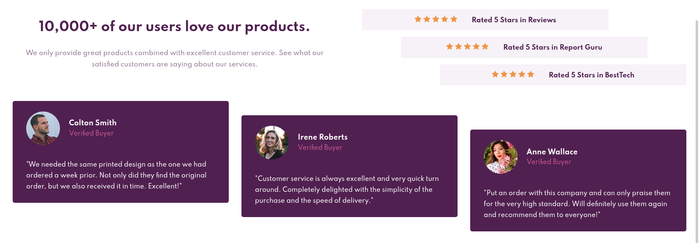

# Frontend Mentor - Social proof section solution

This is a solution to the [Social proof section challenge on Frontend Mentor](https://www.frontendmentor.io/challenges/social-proof-section-6e0qTv_bA). Frontend Mentor challenges help you improve your coding skills by building realistic projects. 

## Overview

### The challenge

Users should be able to:

- View the optimal layout for the section depending on their device's screen size

### Screenshot

### Links

- [Solution](https://github.com/rlabuonora/social-proof-section)
- [Live Site](https://frontend-mentor-social-proof2.netlify.app/)

## My process

### Built with

- Semantic HTML5 markup
- Flexbox
- CSS Grid
- Mobile-first workflow

### What I learned

Good use case for nesting Grids and combining them with Flexbox.

### Continued development

The sizing could be better. I might work on that later.

## Author

- Website - [Rafael La Buonora](https://www.rlabuonora.com)
- Frontend Mentor - [@rlabuonora](https://www.frontendmentor.io/profile/rlabuonora)
- Twitter - [@rlabuonora](https://www.twitter.com/rlabuonora)